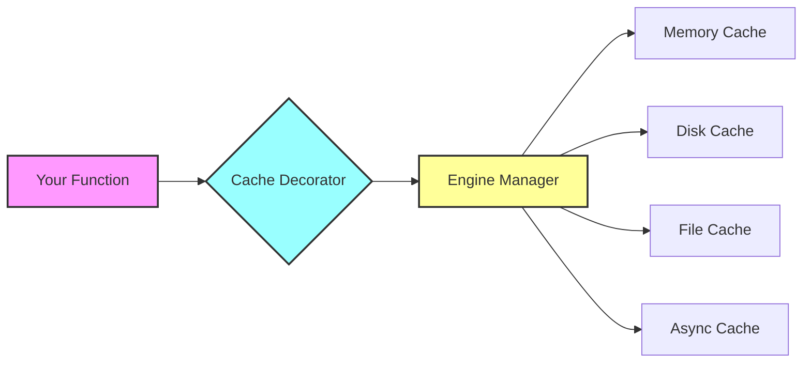

# TWAT-Cache: Advanced Python Caching Library

<div align="center">
  <p>
    <a href="https://pypi.org/project/twat-cache/">
      
    </a>
    <a href="https://pypi.org/project/twat-cache/">
      
    </a>
    <a href="https://github.com/twat-framework/twat-cache/blob/main/LICENSE">
      
    </a>
    <a href="https://github.com/twat-framework/twat-cache/actions">
      
    </a>
  </p>
</div>

**Part of the [TWAT](https://pypi.org/project/twat/) framework** - A collection of advanced Python utilities.

## 🚀 What is TWAT-Cache?

TWAT-Cache is a versatile and high-performance Python library that simplifies caching for your applications. It provides a unified interface to various caching backends through simple decorators, allowing you to dramatically improve performance without significant code changes.

### Key Features

<div class="grid cards" markdown>

- :material-speedometer: **High Performance**
    
    Minimal overhead with support for multiple high-performance backends including Rust-based engines

- :material-puzzle: **Multiple Backends**
    
    Choose from in-memory, disk-based, file-based, or async caching with automatic fallback

- :material-cog: **Flexible Configuration**
    
    Fine-grained control over cache size, TTL, eviction policies, and compression

- :material-api: **Simple API**
    
    One decorator to rule them all - just add `@ucache` to your functions

- :material-sync: **Async Support**
    
    First-class support for async/await with dedicated async cache decorators

- :material-shield-check: **Type Safe**
    
    Full type hints and runtime validation with Pydantic

</div>

## 📦 Quick Installation

=== "Basic"

    ```bash
    pip install twat-cache
    ```
    
    Includes in-memory and disk caching capabilities.

=== "With All Backends"

    ```bash
    pip install "twat-cache[all]"
    ```
    
    Includes all optional backends for maximum flexibility.

=== "Development"

    ```bash
    pip install "twat-cache[dev,test]"
    ```
    
    Includes development and testing tools.

## 🎯 Quick Start

Here's how simple it is to add caching to your Python functions:

```python
from twat_cache import ucache

@ucache  # That's it! Your function is now cached
def expensive_computation(x: int, y: int) -> int:
    """This result will be cached automatically."""
    return x ** y + sum(range(x * y))

# First call computes and caches
result = expensive_computation(5, 3)  # Takes time

# Subsequent calls are instant!
result = expensive_computation(5, 3)  # Returns immediately from cache
```

### Async Functions? No Problem!

```python
from twat_cache import acache
import asyncio

@acache
async def fetch_data(url: str) -> dict:
    """Async functions are cached just as easily."""
    async with aiohttp.ClientSession() as session:
        async with session.get(url) as response:
            return await response.json()

# Use it naturally
data = await fetch_data("https://api.example.com/data")
```

## 🎨 Why TWAT-Cache?

### For Everyone

- **🚀 Performance Boost**: Eliminate redundant computations and API calls
- **🎯 Zero Boilerplate**: Add one decorator and you're done
- **🔄 Flexible Backends**: Switch between caching strategies without code changes
- **📊 Production Ready**: Battle-tested with comprehensive test coverage

### For Data Scientists

- **🧮 Large Object Support**: Efficiently cache NumPy arrays and pandas DataFrames
- **💾 Persistent Caching**: Keep results between sessions with disk-based backends
- **🔬 Scientific Computing**: Integrate with tools like Klepto for advanced use cases

### For Web Developers

- **⚡ API Response Caching**: Cache expensive API calls with TTL support
- **🌐 Async-First**: Built for modern async web frameworks
- **🔧 Framework Integration**: Works seamlessly with FastAPI, Django, and Flask

### For DevOps

- **📈 Monitoring**: Built-in logging and metrics for cache performance
- **🔍 Debugging**: Comprehensive debug mode for troubleshooting
- **🎛️ Configurable**: Environment-based configuration support

## 🏗️ Architecture

TWAT-Cache uses a modular architecture with pluggable backends:



## 📚 Next Steps

<div class="grid cards" markdown>

- :material-rocket-launch: **[Getting Started](getting-started.md)**
    
    Install TWAT-Cache and create your first cached function in 5 minutes

- :material-book-open-variant: **[User Guide](user-guide/index.md)**
    
    Learn about decorators, configuration, and advanced features

- :material-api: **[API Reference](api/index.md)**
    
    Detailed documentation of all classes and functions

- :material-test-tube: **[Examples](examples/index.md)**
    
    Real-world examples and best practices

</div>

## 🤝 Contributing

We welcome contributions! Check out our [Developer Guide](dev-guide/contributing.md) to get started.

## 📄 License

TWAT-Cache is released under the MIT License. See the [LICENSE](https://github.com/twat-framework/twat-cache/blob/main/LICENSE) file for details.

---

<div align="center">
  <p>Built with ❤️ by the TWAT Framework Team</p>
  <p>
    <a href="https://github.com/twat-framework/twat-cache">GitHub</a> •
    <a href="https://pypi.org/project/twat-cache/">PyPI</a> •
    <a href="https://github.com/twat-framework/twat-cache/issues">Issues</a>
  </p>
</div>